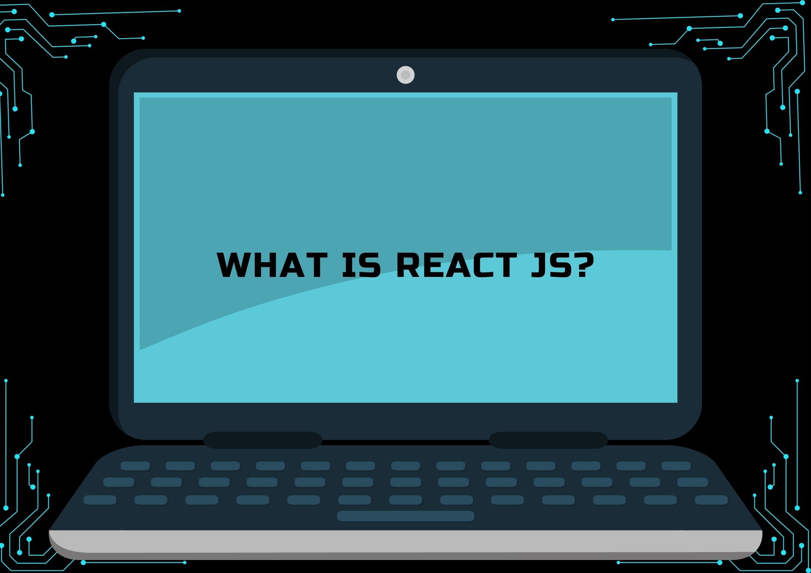
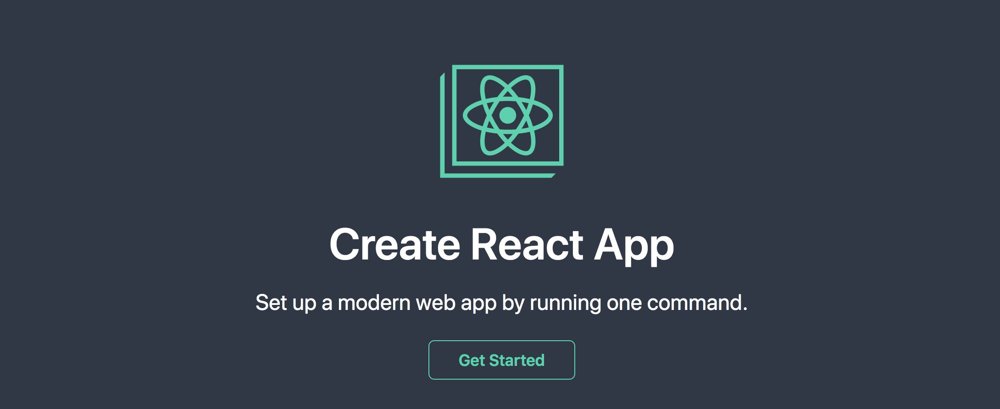
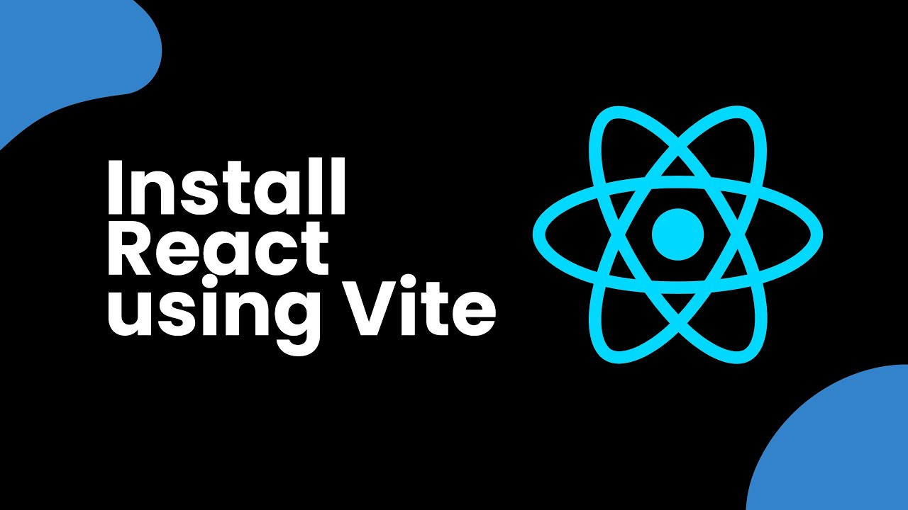
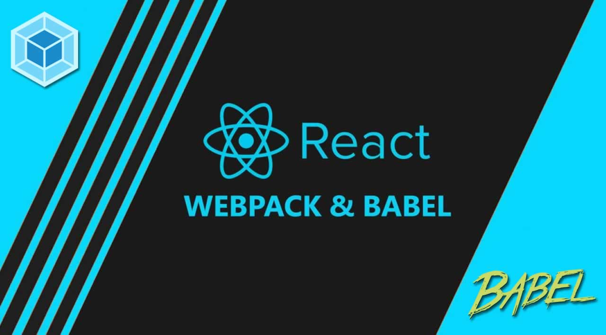

 # REACT JS 

 

<color> #FFA500 React JS is an open-source JavaScript library developed by Facebook for building user interfaces (UIs), especially for dynamic and data-driven web applications. It simplifies the creation of interactive user interfaces by breaking down the app into smaller, reusable components. React is primarily used for building *single-page applications (SPAs)* and can handle updates and renders efficiently based on data changes, making it highly performant and scalable. </color>

 #### React is focused on the "view" layer in the MVC (Model-View-Controller) architecture, and it’s often paired with other libraries like *Redux* or *Next.js* for state management and routing.

##  Main Aspects of React Js 

1. #### *Component Composition Over Inheritance* :
  
   ##### React encourages developers to create small, reusable components that can be composed together to build more complex UIs. This component-based architecture eliminates the need for deep inheritance structures, leading to cleaner, more maintainable code.

2. #### *Virtual DOM for Optimized Performance*:

   ##### React uses a Virtual DOM, which is an in-memory representation of the real DOM. When changes occur, React updates the Virtual DOM first, compares it with the real DOM, and then only updates the parts that have changed. This optimizes rendering performance, as it avoids unnecessary full-page re-renders.

3. #### *Declarative UI Design*:

   ##### In React, you simply describe what the UI should look like for any given state, and React takes care of updating the UI accordingly. This declarative approach is more intuitive and easier to debug compared to imperative approaches, where you manually manipulate the DOM.

4. #### *Unidirectional Data Flow*:

   ##### React follows a unidirectional (one-way) data flow, where data is passed from parent to child components. This makes data management more predictable and debugging easier, as you can track how data flows through your application.

5. #### *JSX Syntax*:
   ##### JSX is a syntax extension that allows you to write HTML-like code within JavaScript. JSX makes the code more readable and allows you to define UI components declaratively within JavaScript. JSX is then compiled into JavaScript by React, enabling dynamic behavior.

6. #### *Hooks for Functional Components*:

   ##### React introduced Hooks (e.g., useState, useEffect, useContext) in version 16.8 to allow functional components to manage state and side effects. Hooks enable developers to write cleaner and less complex code, as they avoid the need for class-based components.

7. #### *React Context for Global State Management*:

   ##### React Context allows you to share data across the entire component tree without the need to pass props manually. It is particularly useful for managing global application state, such as user authentication or theme settings, without excessive prop drilling.

8. #### *Server-Side Rendering (SSR) with Next.js*:

   ##### React can be paired with frameworks like *Next.js* to support server-side rendering. SSR improves SEO, reduces load times, and provides a better initial user experience by pre-rendering content on the server before sending it to the browser.

9. #### *React DevTools for Enhanced Debugging*:

   ##### React DevTools is a powerful browser extension that allows developers to inspect the React component tree, view props and state, and track component re-renders in real time. It is invaluable for debugging and optimizing React applications.

10. #### *Concurrent Mode for Smooth User Experiences*:

   ##### React’s *Concurrent Mode* is an experimental feature that allows React to prioritize critical UI updates (like user interactions) while deferring less critical updates. This leads to smoother user experiences, especially in complex, data-intensive applications.

## How to Install React JS?
##### React offers several ways to install and set up a development environment, each suited for different needs and preferences. Below are different methods to install React JS, from the easiest way using *Create React App* (CRA) to a more advanced setup using *Vite* or a *manual configuration* with Webpack and Babel.

## *A.  Installing React with Create React App (CRA)*

 

##### *Create React App* is the easiest and most commonly used tool to set up a React application. It abstracts the configuration and provides a ready-to-use environment with Webpack, Babel, and other tools.

## Steps to Set Up React Using CRA: 

1. #### *Install Node.js and npm (or Yarn)*: 

- Before you start, you need *Node.js* installed. It provides the package manager *npm* (or *Yarn* if you prefer).

#### Download Node.js from 
<a href= "https://nodejs.org/en/" target="_blank"> nodejs.org </a>

> node -v
> npm -v

   - Alternatively, you can install *Yarn* by running:
    
> npm install -g yarn

2. #### *Create a React Application*

 - Open your terminal and run the following command:
    
> npx create-react-app my-react-app

- Replace my-react-app with your desired project name.

3. #### *Navigate to Your Project Directory*

- After the app is created, navigate into the newly created directory
  
    > cd my-react-app

4. #### *Install Dependencies* (Optional with Yarn)

- CRA will automatically install dependencies, but if you are using Yarn, run:

    > yarn install

5. #### *Run the React Development Server*: 

- Start the server to see your app in the browser:

    > npm start

- or with Yarn: 

    > yarn Start 

## *B. Installing React with Vite (Recommended for Faster Builds)*

##### *Vite* is a modern build tool that provides faster development builds and an improved development experience by using ES modules. It is especially suitable for larger applications with rapid feedback.

## *Steps to Set Up React with Vite*: 

1. ##### *Install Node.js*:
   - Ensure *Node.js* is installed by following the previous steps.

2. ##### *Create a New Project Using Vite*:
   - Run the following command in your terminal:
    
    > npm create vite@latest my-vite-react-app --template react

    > Replace my-vite-react-app with your desired project name.

3. ##### *Navigate to Your Project Folder*:
   After the project is created, go to the project directory:
  
    > cd my-vite-react-app

4. ##### *Install Dependencies*:
   Use *npm* or *Yarn* to install the required packages:
  
    > npm install

  Or with Yarn:
  
    > yarn install

5. ##### *Run the Development Server*:
   - To start the Vite server, run:
    
    > npm run dev

    Or with Yarn:
    
    > yarn dev

  Your app will be available at <a href= "http://localhost:5173" target= "_blank"> Available here </a>

---

## *C. Installing React with Manual Setup (Using Webpack & Babel)*

##### For users who want full control over their configuration, manually setting up React with *Webpack* and *Babel* allows for customized builds. This setup is useful for larger projects or when specific configurations are required.

## *Steps to Set Up React Manually*:

1. <b> Install Node.js:
   Install **Node.js** from the official website if you haven’t done so already. </b>

2. <b> Initialize a New Node.js Project: </b> Create a new project folder and initialize it: 
  
    > mkdir my-react-app
    > cd my-react-app
    > npm init -y

3. <b> Install React and React DOM: </b>
  
    > npm install react react-dom

4. <b> Install Development Tools: </b> You'll need *Webpack* and *Babel* to transpile modern JavaScript and JSX:
  
> npm install --save-dev webpack webpack-cli webpack-dev-server babel-loader @babel/core @babel/preset-env @babel/preset-react html-webpack-plugin

5. <b> Configure Webpack: </b>
   Create a webpack.config.js file in the project root: 
  
> const path = require('path');
const HtmlWebpackPlugin = require('html-webpack-plugin');

> module.exports = {
entry: './src/index.js',
output: {
path: path.resolve(__dirname, 'dist'),
filename: 'bundle.js',
},
devServer: {
contentBase: path.resolve(__dirname, 'dist'),
port: 3000,
},
module: {
rules: [
{
test: /\.jsx?$/,
exclude: /node_modules/,
use: {
loader: 'babel-loader',
},
},
],
},
resolve: {
extensions: ['.js', '.jsx'],
},
plugins: [
new HtmlWebpackPlugin({
template: './public/index.html',
}),
],
};

6. <b> Babel Configuration: </b> 
   Create a .babelrc file to configure Babel:
  
> {
"presets": ["@babel/preset-env", "@babel/preset-react"]
}

7.<b> Create the React Files: </b> 
 
 Create a src directory with an index.js file containing the main React component:
    
> import React from 'react';
import ReactDOM from 'react-dom';

> const App =

> () => <h5>Hello, React!</h5>;

ReactDOM.render(<App />, document.getElementById('root'));
- Create a public/index.html file with a root element

8. <b> Start the Development Server: </b>

- Add a start script to your package.json:
  
> "scripts": { "start": "webpack serve --mode development"}

  Then, run the server:
  
    > npm start

---

##### *By following any of these installation methods, you can easily get started with React JS development, whether you're looking for a simple setup with *Create React App*, a fast and modern approach with *Vite*, or a custom configuration with *Webpack and Babel*. Choose the method that best suits your project's requirements and development preferences.* 

---

##### CAS, ALECZIZ T.
#### BSCPE 2-1 

